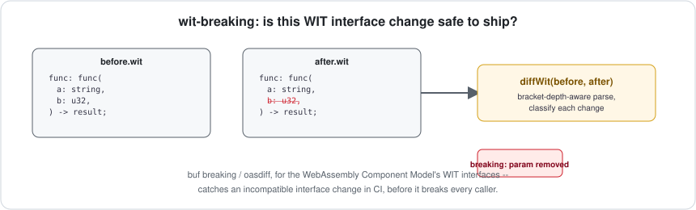

# wit-breaking

[](https://github.com/jayblast-spec/wit-breaking/actions/workflows/ci.yml)
[](https://www.npmjs.com/package/wit-breaking)
[](./LICENSE)



**Detects breaking changes between two versions of a WebAssembly Component Model WIT interface — the equivalent of `buf breaking` (protobuf) or `oasdiff` (OpenAPI), for WIT.**

## Background, for anyone new to this

If you don't work with WebAssembly components day to day, here's the context that makes the rest of this README make sense.

**What WIT is.** The [WebAssembly Component Model](https://component-model.bytecodealliance.org/) lets you compile a library in Rust, publish it as a `.wasm` component, and have someone else load and call it from Go, Python, or JavaScript — without either side knowing what language the other is written in. For that to work, both sides need to agree on a contract: what functions exist, what arguments they take, what they return. That contract is written in **WIT** (Wasm Interface Type), a small interface-description language. A WIT `interface` block looks like this:

```wit
interface key-value {
  get: func(key: string) -> option<string>;
  set: func(key: string, value: string);
}
```

Any component that exports this `key-value` interface promises those two functions exist with those exact signatures. Any component that imports it is trusting that promise.

**Why "breaking changes" are a real problem here.** Components get rebuilt and republished over time, same as any library. If a new version of a component silently changes `set`'s signature — adds a required parameter, changes a return type — every other component that imports the old `key-value` interface now fails to compose with it, possibly not until someone tries to link them together and gets a confusing error far from the actual change. This is exactly the problem protobuf and OpenAPI solved years ago with dedicated tools (`buf breaking`, `oasdiff`) that diff two versions of a schema and tell you, in plain language, what would break. WIT didn't have an equivalent — this project is that tool for WIT.

## What it actually does

You give it two WIT documents — normally "this interface before my change" and "this interface after my change" — and it walks every interface and every function in both, and classifies each difference:

| What changed | Verdict | Why |
|---|---|---|
| A function was removed | **Breaking** | Anyone calling it now gets a link/runtime error. |
| A function's parameters changed | **Breaking** | Existing callers pass the old argument shape. |
| A function's return type changed | **Breaking** | Existing callers expect the old shape back. |
| A whole interface was removed | **Breaking** | Everything that imported it breaks. |
| A function was added | Safe | Nobody was calling it before, so nobody can be broken by it existing now. |
| A whole interface was added | Safe | Same reasoning, one level up. |

```bash
npx wit-breaking before.wit after.wit
```

```
BREAKING  key-value.set: function "set" parameters changed: "(key: string, value: string)" -> "(key: string, value: string, ttl-seconds: u32)"
BREAKING  key-value.delete: function "delete" was removed
safe      key-value.list-keys: function "list-keys" was added

2 breaking, 1 safe.
```

Exit code `1` if anything breaking is found, `0` otherwise. Where do the two `.wit` files come from? If you already hand-write WIT, you have them. If you're diffing two versions of a compiled `.wasm` component, extract each one's interface with the official Bytecode Alliance tool: `wasm-tools component wit my-component.wasm > interface.wit`, then diff the two extracted files with this tool.

## Use it as a GitHub Action

The fastest way to get real value from this: add it to your CI so a breaking WIT change fails the build automatically, the same way a broken test would.

```yaml
- name: Extract WIT from both builds
  run: |
    wasm-tools component wit ./before/my-component.wasm > before.wit
    wasm-tools component wit ./after/my-component.wasm > after.wit

- name: Check for breaking interface changes
  uses: jayblast-spec/wit-breaking@main
  with:
    before: before.wit
    after: after.wit
    # fail-on-breaking: 'false'   # uncomment to only annotate, never fail the build
```

The action exposes two outputs (`breaking` — `"true"`/`"false"`, and `summary` — the full text report) if you want to post the result somewhere yourself instead of just failing the step.

## Honest design tradeoffs

Every choice below was made deliberately, and each one trades some completeness for something else that mattered more. Worth reading before you trust this in CI.

**It reads WIT text, not `.wasm` binaries — on purpose, not because it was easier.** The obvious way to extract a component's interface is through the Bytecode Alliance's own JS tooling (`@bytecodealliance/jco`). I actually installed it and inspected its API while building this, and its dependency tree currently pulls in a **critical-severity** transitive vulnerability — a Zip Slip archive-extraction bug, several layers down, used only at that toolchain's own build time, but still not something I'm willing to add to your `node_modules` for a tool meant to sit in your CI pipeline. Since extracting WIT from a binary already has a canonical, official, actively-maintained tool (`wasm-tools component wit`), duplicating that logic here would only add risk for no real benefit. So `wit-breaking` takes WIT *text* as input and has zero runtime dependencies — pipe the official extractor's output into it.

**It diffs signatures textually, not a full type system.** If a function's parameter list changes at all — a type renamed, reordered, widened, narrowed — this tool flags it as breaking, full stop. It does not attempt to understand, for instance, that widening a `variant` to accept one more case is actually backward-compatible while narrowing it isn't. Building that correctly means implementing WIT's real type system, which is a much bigger and riskier undertaking than a v1 warrants. The practical effect: this tool will occasionally flag a change as breaking when a deeper analysis would call it safe, but it will never miss a real break. For a CI gate, that's the right side to err on.

## Install

```bash
npm install --save-dev wit-breaking
```

## Library usage

```ts
import { parseWit, diffWit } from "wit-breaking";

const result = diffWit(parseWit(beforeSource), parseWit(afterSource));
if (result.breaking) {
  for (const change of result.changes.filter((c) => c.severity === "breaking")) {
    console.error(change.description);
  }
  process.exit(1);
}
```

Run the annotated demo:

```bash
npx tsx examples/demo.ts
```

## Not in v1, and why

- **`world` import/export diffing.** A WIT `world` bundles interfaces together into what a whole component imports/exports; interfaces are the primary contract surface underneath that, so they came first. Worlds are a real, planned extension — not something silently half-supported here today.
- **Package version / semver policy enforcement.** This tool tells you *what* changed. Deciding what your version-numbering scheme should do in response (bump major, block the release, just warn) is a policy decision specific to your project, not something a diffing tool should impose.

## Development

```bash
npm install
npm run typecheck
npm test
npm run build
```

## License

MIT
